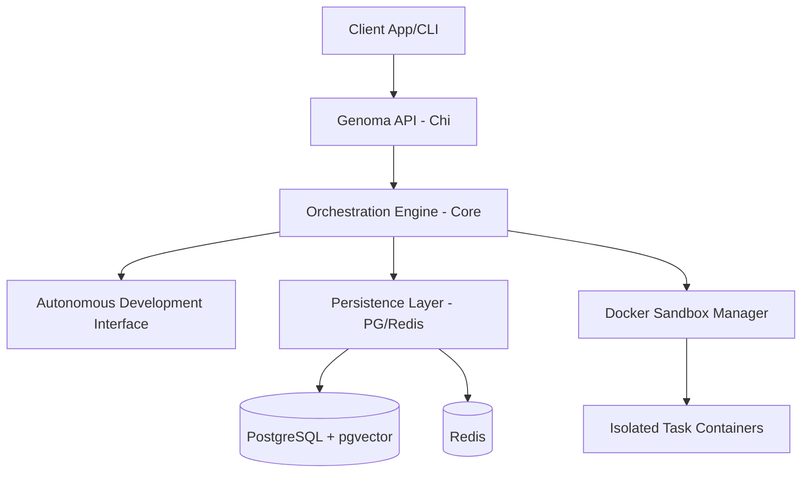

# Genoma Framework


## Overview

**Genoma** is a high-performance, Agent-Based Software Development (ABSD) framework built in Go. It empowers developers to create complex, autonomous systems with a focus on orchestration, security, and scalability through a hybrid persistence layer and containerized execution environments.

## Key Features

- 🧩 **Advanced Orchestration**: Powerful DAG-based engine for complex agent workflows.
- 🛡️ **Secure Sandbox**: Docker-integrated execution environment for safe code isolation.
- 🗄️ **Hybrid Persistence**: Native support for PostgreSQL (JSONB + pgvector) and Redis caching.
- 🤖 **ADI (Autonomous Development Interface)**: Built-in interface for autonomous system evolution.
- 💬 **Integrated Chat**: Standardized messaging protocol for agent-to-human and agent-to-agent interaction.
- ⚡ **Go-Powered**: Leverages Go 1.22+ features for maximum concurrency and performance.

## Architecture



## Getting Started

### Prerequisites

- Go 1.22+
- Docker & Docker Compose
- PostgreSQL (with pgvector extension)
- Redis

### Installation

1. **Clone the repository**:
   ```bash
   git clone https://github.com/acassiovilasboas/genoma.git
   cd genoma
   ```

2. **Setup environment**:
   ```bash
   cp .env.example .env
   # Edit .env with your credentials
   ```

3. **Start infrastructure**:
   ```bash
   make docker-up
   ```

4. **Run migrations**:
   ```bash
   make migrate-up
   ```

5. **Build and run**:
   ```bash
   make build
   ./bin/genoma
   ```

## Development

Check the `Makefile` for common development tasks:

- `make test`: Run unit tests
- `make fmt`: Format code
- `make lint`: Run golangci-lint
- `make build-linux`: Cross-compile for Linux environments

## Roadmap

- [ ] v0.1.0: Core engine and basic sandbox integration. (Current)
- [ ] v0.2.0: Enhanced ADI with self-healing capabilities.
- [ ] v0.3.0: Multi-agent collaboration protocols.

## Contributing

We welcome contributions! Please see [CONTRIBUTING.md](CONTRIBUTING.md) for details.

## License

This project is licensed under the MIT License - see the [LICENSE](LICENSE) file for details.

---

Built with ❤️ by [Acassio Mendonça](https://github.com/acassiovilasboas)
