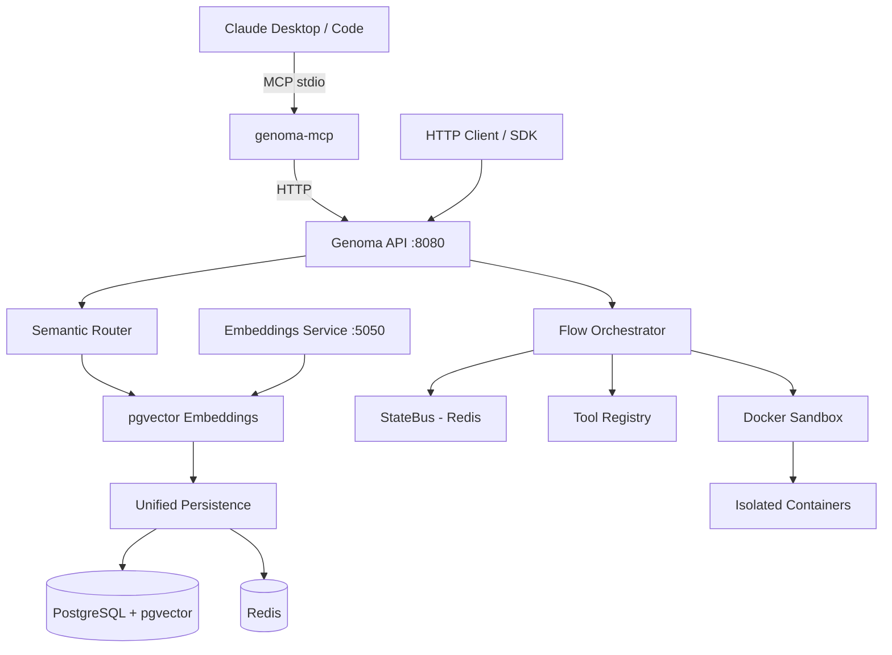

# Genoma Framework


**Genoma** is a high-performance AI agent orchestration framework written in Go. It lets you build multi-step agent pipelines as directed graphs of nodes, where each node runs an isolated Python or Node.js script in a Docker sandbox. A semantic router matches natural-language inputs to the right flow using pgvector embeddings.

## Features

- **DAG Orchestration** — Directed graphs with conditional edges, feedback loops, cycle limits and parallel execution.
- **Docker Sandbox** — Each node script runs in an isolated container with CPU, memory, network and PID limits.
- **Semantic Router** — Routes chat messages to flows using cosine similarity over pgvector embeddings.
- **Human-in-the-Loop (HITL)** — Flows can pause and request human feedback before continuing.
- **Flow Scheduler** — Schedule flow executions for a future timestamp.
- **Knowledge Base** — Ingest and semantically search documents via pgvector.
- **MCP Server** — Expose Genoma as an MCP tool server for Claude Desktop and Claude Code.
- **Hybrid Persistence** — PostgreSQL (JSONB + pgvector) + Redis state bus.

## Quick Start

### Prerequisites

- Docker and Docker Compose

That's it. Go, PostgreSQL and Redis all run inside Docker.

### Start the stack

```bash
git clone https://github.com/acassiovilasboas/genoma.git
cd genoma
docker compose up
```

The framework will be available at `http://localhost:8080`.

> The first startup pulls base images and builds the sandbox layer — this takes a few minutes.

### Health check

```bash
curl http://localhost:8080/health
# {"framework":"genoma","status":"healthy","version":"0.1.0"}
```

## API Endpoints

All endpoints are prefixed with `/api/v1`. Authentication is via the `X-API-Key` header when `GENOMA_API_KEY` is set.

### Nodes

| Method   | Path                    | Description                       |
|----------|-------------------------|-----------------------------------|
| `POST`   | `/nodes`                | Create a node definition          |
| `GET`    | `/nodes`                | List nodes (`?limit=&offset=`)    |
| `GET`    | `/nodes/{nodeID}`       | Get a node                        |
| `PUT`    | `/nodes/{nodeID}`       | Update a node                     |
| `DELETE` | `/nodes/{nodeID}`       | Delete a node                     |

**Create node example:**

```json
POST /api/v1/nodes
{
  "name": "summarise",
  "purpose": "Summarise the input text in one paragraph",
  "script_lang": "python",
  "script_content": "import json,sys\nd=json.load(sys.stdin)\nprint(json.dumps({'summary': d['text'][:200]}))",
  "timeout_sec": 30,
  "max_retries": 3
}
```

### Flows

| Method   | Path                          | Description                  |
|----------|-------------------------------|------------------------------|
| `POST`   | `/flows`                      | Create a flow                |
| `GET`    | `/flows`                      | List flows                   |
| `GET`    | `/flows/{flowID}`             | Get a flow                   |
| `DELETE` | `/flows/{flowID}`             | Delete a flow                |
| `POST`   | `/flows/{flowID}/execute`     | Execute a flow immediately   |
| `POST`   | `/flows/{flowID}/schedule`    | Schedule a future execution  |

**Execute flow example:**

```json
POST /api/v1/flows/{flowID}/execute
{"input": {"text": "long article..."}}
```

Response is either a `FlowResult` (completed) or a `202 Accepted` with `"status": "WAITING_FEEDBACK"` (paused for HITL).

### Schedules

| Method   | Path                        | Description              |
|----------|-----------------------------|--------------------------|
| `GET`    | `/schedules`                | List scheduled runs      |
| `DELETE` | `/schedules/{scheduleID}`   | Cancel a scheduled run   |

### Runs & Human-in-the-Loop

| Method | Path                         | Description                          |
|--------|------------------------------|--------------------------------------|
| `GET`  | `/runs/{runID}`              | Get run status and HITL prompt       |
| `POST` | `/runs/{runID}/feedback`     | Submit feedback to unblock a run     |

```json
POST /api/v1/runs/{runID}/feedback
{"feedback": "approve the proposed changes"}
```

### Knowledge Base

| Method   | Path                         | Description                    |
|----------|------------------------------|--------------------------------|
| `POST`   | `/knowledge/ingest`          | Ingest a document              |
| `POST`   | `/knowledge/search`          | Semantic search (`top_k`)      |
| `DELETE` | `/knowledge/{docID}`         | Delete a document              |

### Chat

| Method | Path                              | Description                               |
|--------|-----------------------------------|-------------------------------------------|
| `POST` | `/chat/message`                   | Send a message — routed to best flow      |
| `GET`  | `/chat/ws/{sessionID}`            | WebSocket connection for streaming chat   |
| `GET`  | `/chat/sessions/{sessionID}`      | Get conversation history                  |

### Tools & Build

| Method | Path              | Description                      |
|--------|-------------------|----------------------------------|
| `GET`  | `/tools`          | List built-in tools              |
| `POST` | `/build`          | Build an app artifact (tar)      |

### Health

| Method | Path       | Description |
|--------|------------|-------------|
| `GET`  | `/health`  | Liveness    |

## MCP Server (Claude Desktop / Claude Code)

The `genoma-mcp` binary is a standalone [Model Context Protocol](https://modelcontextprotocol.io) server. It proxies MCP tool calls to the Genoma HTTP API over stdio — it does **not** import any Genoma internals.

### Build the binary

```bash
# Linux / macOS
docker compose run --rm --entrypoint="" genoma sh -c \
  "cp /app/genoma-mcp /tmp/genoma-mcp" && \
  docker cp $(docker compose ps -q genoma):/app/genoma-mcp ./bin/genoma-mcp

# Or build locally if Go ≥ 1.22 is installed
go build -o ./bin/genoma-mcp ./cmd/mcp
```

### Configure Claude Desktop

Add to `~/Library/Application Support/Claude/claude_desktop_config.json` (macOS) or `%APPDATA%\Claude\claude_desktop_config.json` (Windows):

```json
{
  "mcpServers": {
    "genoma": {
      "command": "/absolute/path/to/genoma-mcp",
      "env": {
        "GENOMA_API_URL": "http://localhost:8080",
        "GENOMA_API_KEY": ""
      }
    }
  }
}
```

### Configure Claude Code

```bash
claude mcp add genoma /absolute/path/to/genoma-mcp \
  -e GENOMA_API_URL=http://localhost:8080 \
  -e GENOMA_API_KEY=
```

Or add to your project's `.mcp.json`:

```json
{
  "mcpServers": {
    "genoma": {
      "command": "/absolute/path/to/genoma-mcp",
      "env": {
        "GENOMA_API_URL": "http://localhost:8080",
        "GENOMA_API_KEY": ""
      }
    }
  }
}
```

### Available MCP tools

| Tool                       | Description                                      |
|----------------------------|--------------------------------------------------|
| `genoma_list_flows`        | List registered flows                            |
| `genoma_get_flow`          | Get a flow by ID                                 |
| `genoma_create_flow`       | Create a new flow                                |
| `genoma_execute_flow`      | Execute a flow with JSON input                   |
| `genoma_list_nodes`        | List node definitions                            |
| `genoma_get_node`          | Get a node by ID                                 |
| `genoma_create_node`       | Create a node with Python/NodeJS script          |
| `genoma_get_run`           | Poll a run for status or HITL prompt             |
| `genoma_submit_feedback`   | Unblock a WAITING_FEEDBACK run                   |
| `genoma_chat`              | Send a natural-language message                  |
| `genoma_ingest_knowledge`  | Ingest a document into the knowledge base        |
| `genoma_search_knowledge`  | Semantic search over the knowledge base          |
| `genoma_list_tools`        | List built-in node tools                         |
| `genoma_list_schedules`    | List scheduled flow executions                   |

## Environment Variables

| Variable                      | Default                        | Description                                      |
|-------------------------------|--------------------------------|--------------------------------------------------|
| `GENOMA_HOST`                 | `0.0.0.0`                      | Server bind address                              |
| `GENOMA_PORT`                 | `8080`                         | HTTP port                                        |
| `GENOMA_READ_TIMEOUT`         | `30s`                          | HTTP read timeout                                |
| `GENOMA_WRITE_TIMEOUT`        | `60s`                          | HTTP write timeout                               |
| `GENOMA_API_KEY`              | _(empty — auth disabled)_      | Enable API key auth (`X-API-Key` header)         |
| `GENOMA_DB_HOST`              | `localhost`                    | PostgreSQL host                                  |
| `GENOMA_DB_PORT`              | `5432`                         | PostgreSQL port                                  |
| `GENOMA_DB_USER`              | `genoma`                       | PostgreSQL user                                  |
| `GENOMA_DB_PASSWORD`          | `genoma`                       | PostgreSQL password                              |
| `GENOMA_DB_NAME`              | `genoma`                       | PostgreSQL database name                         |
| `GENOMA_DB_SSLMODE`           | `disable`                      | PostgreSQL SSL mode                              |
| `GENOMA_DB_MAX_CONNS`         | `20`                           | PostgreSQL max connection pool size              |
| `GENOMA_REDIS_ADDR`           | `localhost:6379`               | Redis address                                    |
| `GENOMA_REDIS_PASSWORD`       | _(empty)_                      | Redis password                                   |
| `GENOMA_REDIS_DB`             | `0`                            | Redis database index                             |
| `GENOMA_EMBEDDING_URL`        | `http://localhost:5050`        | Embeddings micro-service URL                     |
| `GENOMA_EMBEDDING_DIMS`       | `384`                          | Embedding vector dimensions                      |
| `GENOMA_SANDBOX_IMAGE`        | `genoma-sandbox:latest`        | Docker image used for node execution             |
| `GENOMA_DOCKER_HOST`          | `unix:///var/run/docker.sock`  | Docker socket path                               |
| `GENOMA_SANDBOX_MEMORY_MB`    | `256`                          | Sandbox container memory limit (MB)              |
| `GENOMA_SANDBOX_CPU_QUOTA`    | `50000`                        | Sandbox CPU quota (µs per 100ms period)          |
| `GENOMA_SANDBOX_TIMEOUT`      | `30s`                          | Sandbox execution timeout                        |
| `GENOMA_SANDBOX_NO_NETWORK`   | `true`                         | Disable network inside sandbox containers        |

**MCP server variables** (set in Claude Desktop / Claude Code config):

| Variable           | Default                  | Description                  |
|--------------------|--------------------------|------------------------------|
| `GENOMA_API_URL`   | `http://localhost:8080`  | Genoma HTTP API base URL     |
| `GENOMA_API_KEY`   | _(empty)_                | API key (matches server key) |

## Architecture



## Development

```bash
# Rebuild after code changes
docker compose build genoma

# View logs
docker compose logs -f genoma

# Run unit tests (requires Go locally)
go test ./internal/...

# Format code
go fmt ./...
```

## Roadmap

- [x] v0.1.0 — Core engine, DAG orchestration, Docker sandbox, pgvector semantic router, HITL, scheduler, tool catalogue, MCP server
- [ ] v0.2.0 — Enhanced ADI with self-healing capabilities
- [ ] v0.3.0 — Multi-agent collaboration protocols

## Contributing

See [CONTRIBUTING.md](CONTRIBUTING.md).

## License

MIT — see [LICENSE](LICENSE).

---

Built by [Acassio Mendonça](https://github.com/acassiovilasboas)
